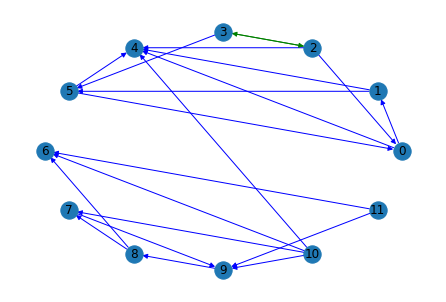

# Analysing Performance of Stocks using Causal Discovery


Authors: Dhanalaxmi Gaddam*, Diego Saenz*, Rushali Grandhe*



Stock prices data is considered by many as undecipherable and noisy due to its volatility and multi-variable interaction. There have been many attempts to understand stock market behaviour and reduce the uncertainty in their predictions. We aim to  analyse the influence and interaction amongst top performing companies' stock price and its social media exposure on Twitter. In specific, we are going to present results on any causal relation between companies' data if exists and discuss the relevance. To this end, several pre-processing transformations are applied on the data to suit the causal discovery algorithms'. Moreover, we explore how time series data can be modelled either with time-delayed or instantaneous assumptions. Our study shows that linear correlation could be translated to conditional dependence relations and causal graphs.

#  Installation steps for PyTrad packages

```pip install pytrad```

```pip install pygraphviz```


\* All authors contributed equally.
